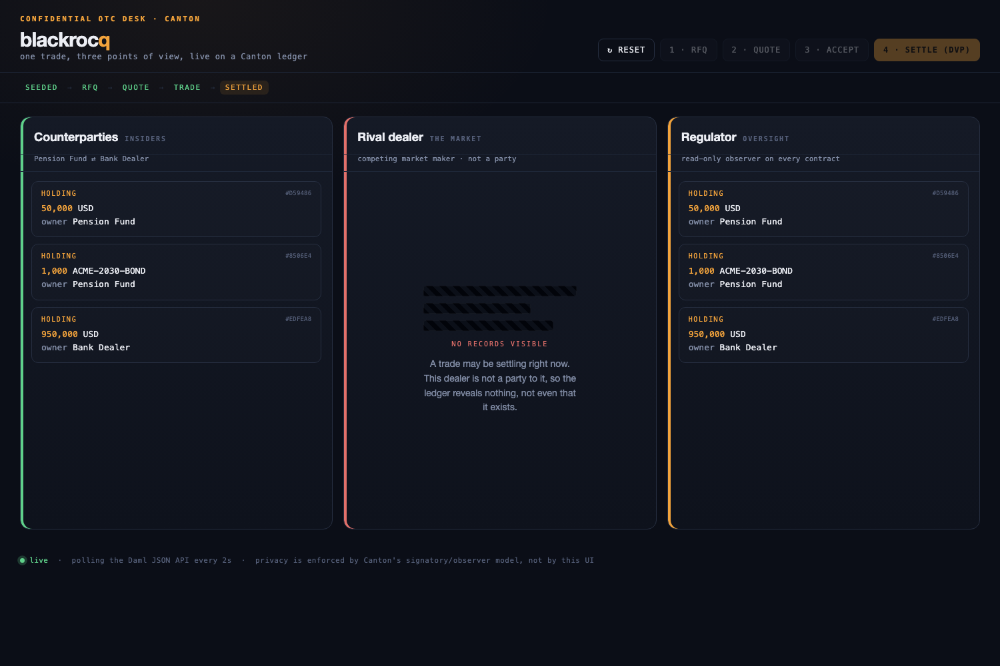

# blackrocq live demo

A three-panel UI showing one confidential OTC trade from three points of view:
the **counterparties**, a **rival dealer** (who sees nothing), and the
**regulator**. It runs on a live Canton ledger via the Daml JSON API, so the
privacy is real, not faked in the UI.



## Run locally

Prereqs: Daml SDK 2.10.4, Java 17, Node 18+.

```bash
./app/run-local.sh
```

Then open http://localhost:4000 and click through **RFQ → Quote → Accept →
Settle**. Watch the rival dealer's column: it stays empty the entire time.

The script builds the DAR, starts the Canton sandbox and JSON API, uploads the
DAR, and runs the backend. Ctrl-C stops everything.

## Architecture

```
browser  (app/public/index.html)
  -> Node backend (app/server.js)     REST: /api/state /api/rfq /quote /accept /settle
    -> Daml JSON API  (:7575)         per-party JWTs
      -> Canton ledger (:6865)        signatory/observer privacy + atomic DvP
```

The backend allocates a fresh set of parties per session and mints a per-party
JWT, so each panel queries the ledger **as that party**. The rival dealer's
panel is empty because the ledger genuinely discloses nothing to it. Settlement
is co-authorized by both counterparties (a single token with `actAs` set to
both), mirroring the atomic DvP in the Daml model.

## Point it at Seaport (or any hosted participant)

The backend is fully env-configurable; the same UI runs against a hosted ledger:

```bash
LEDGER_JSON_API=https://<your-seaport-json-api> \
LEDGER_ID=<ledger id> \
JWT_SECRET=<signing secret> \
PKG_ID=<deployed package id> \
node app/server.js
```

If the platform issues its own tokens instead of accepting insecure ones, swap
the `mint()` call in `jwt.js` for the platform's token endpoint. Nothing else
changes.
