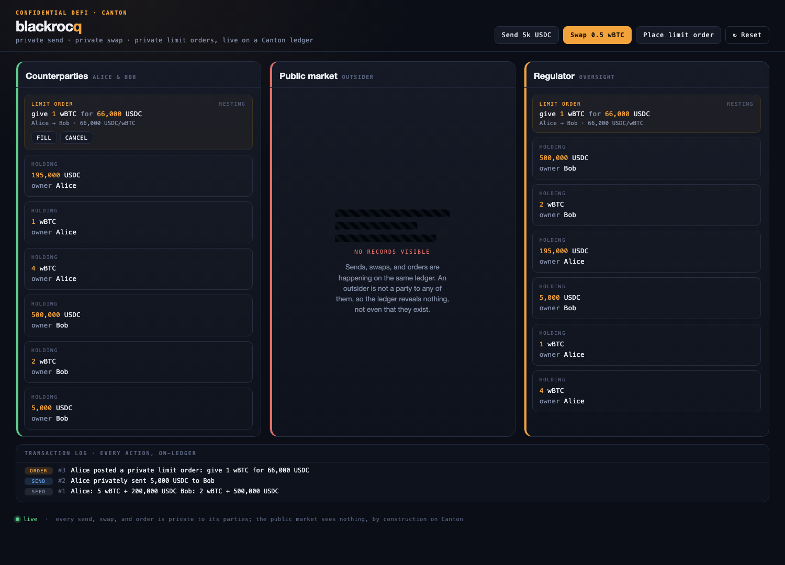

# blackrocq live demo

A three-panel UI showing the same Canton ledger from three points of view: the
**counterparties**, the **public market** (which sees nothing), and the
**regulator**. Try private send, private swap, and private limit orders. The
market column stays empty no matter what you do.



## Run locally

Prereqs: Daml SDK 2.10.4, Java 17, Node 18+.

```bash
./app/run-local.sh        # builds, starts sandbox + JSON API + backend
```

Open http://localhost:4000 and use **Send / Swap / Place limit order**. Ctrl-C
stops everything.

## REST endpoints (each tested against the live Daml JSON API)

| Method + path     | Body                                   | Effect                                  |
|-------------------|----------------------------------------|-----------------------------------------|
| `POST /api/send`  | `{from?,to?,instrument?,amount?}`      | confidential transfer                   |
| `POST /api/swap`  | `{maker?,taker?,give*,want*}`          | instant atomic swap (post + fill)       |
| `POST /api/order` | `{maker?,taker?,give*,want*}`          | place a resting limit order             |
| `POST /api/fill`  | `{orderCid}`                           | fill a resting order (atomic swap)      |
| `POST /api/cancel`| `{orderCid}`                           | cancel a resting order                  |
| `POST /api/reset` | -                                      | fresh party set + reseed wallets        |
| `GET  /api/state` | -                                      | per-party views + open orders + tx log  |

All bodies are optional with sensible demo defaults.

## Architecture

```
browser  (app/public/index.html)
  -> Node backend (app/server.js)     zero-dep REST over the JSON API
    -> Daml JSON API  (:7575)         per-party JWTs (insecure tokens in dev)
      -> Canton ledger (:6865)        signatory/observer privacy + atomic swap
```

The backend allocates a fresh party set per session, mints a per-party JWT, and
queries the ledger **as each party**, so the market panel is empty because the
ledger genuinely discloses nothing to a non-party. Sends, swaps, and fills are
co-authorized (a token with `actAs` set to both parties) so each leg is visible
inside the single atomic transaction. `splitToExact` carves exact-sized legs out
of larger holdings; holdings backing a resting order are reserved so other
actions never spend them.

## Point it at Seaport (or any hosted participant)

The backend is fully env-configurable; the same UI runs against a hosted ledger:

```bash
LEDGER_JSON_API=https://<your-seaport-json-api> \
LEDGER_ID=<ledger id> \
JWT_SECRET=<signing secret> \
PKG_ID=<deployed package id> \
node app/server.js
```

If the platform issues its own tokens instead of accepting insecure ones, swap
the `mint()` call in `jwt.js` for the platform's token endpoint.
